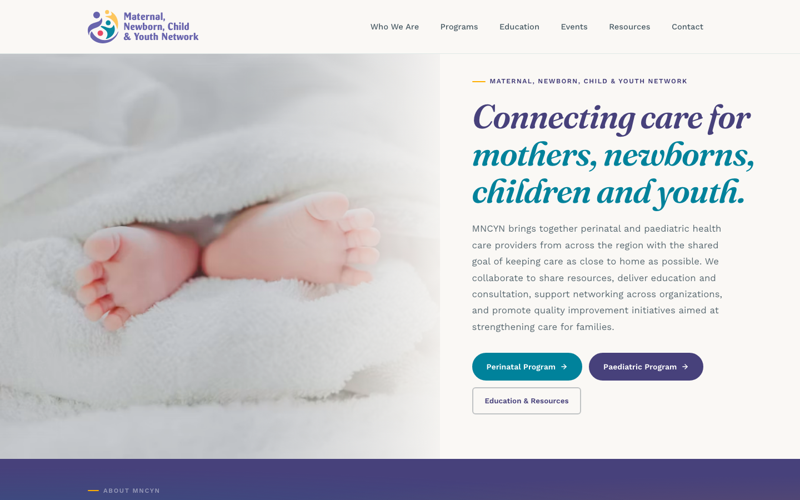
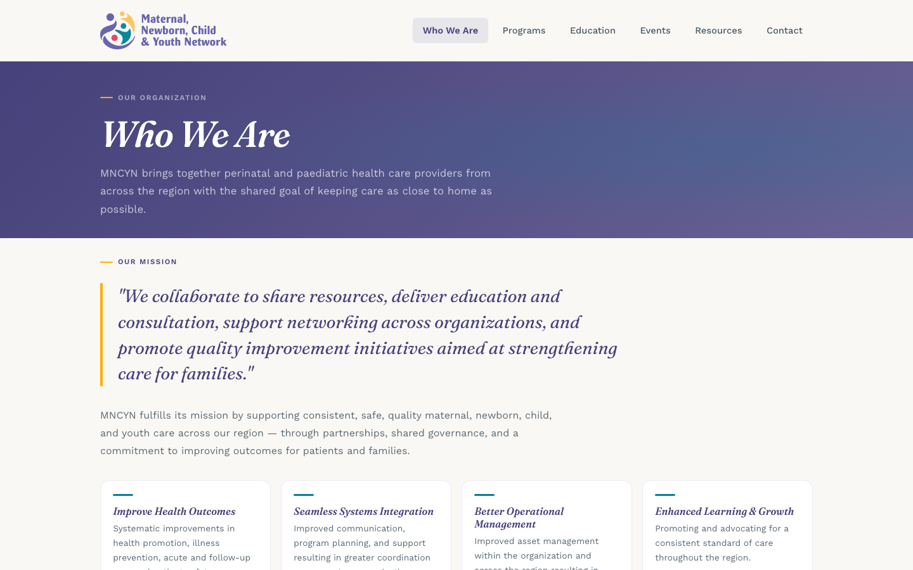
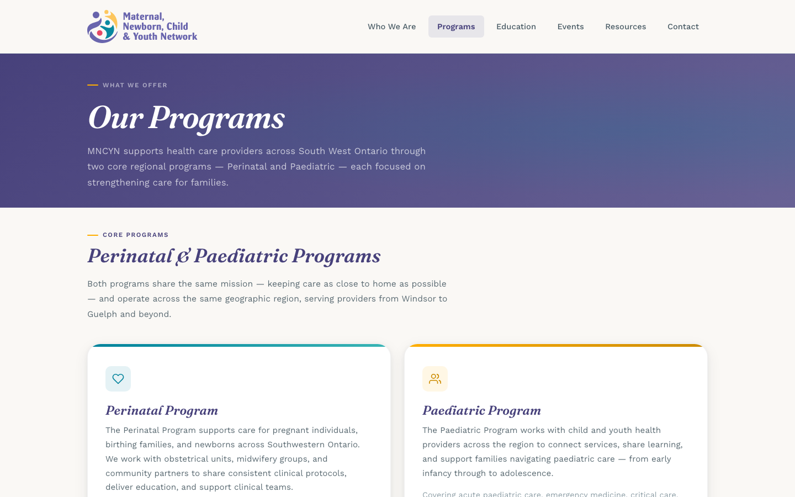
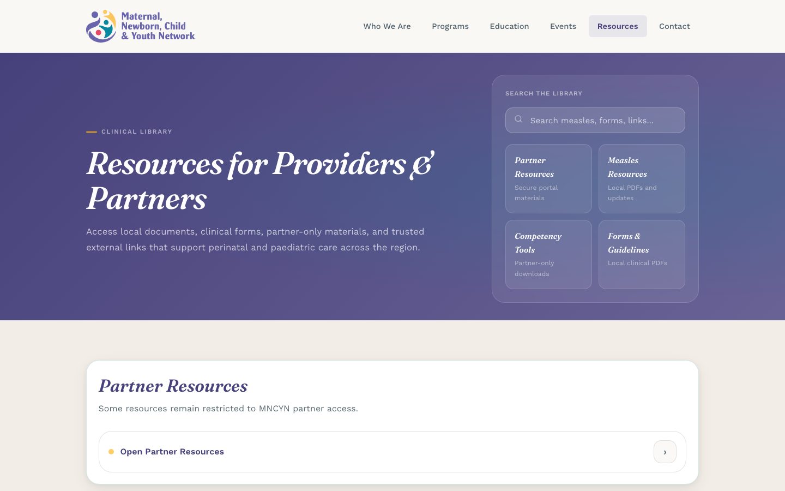
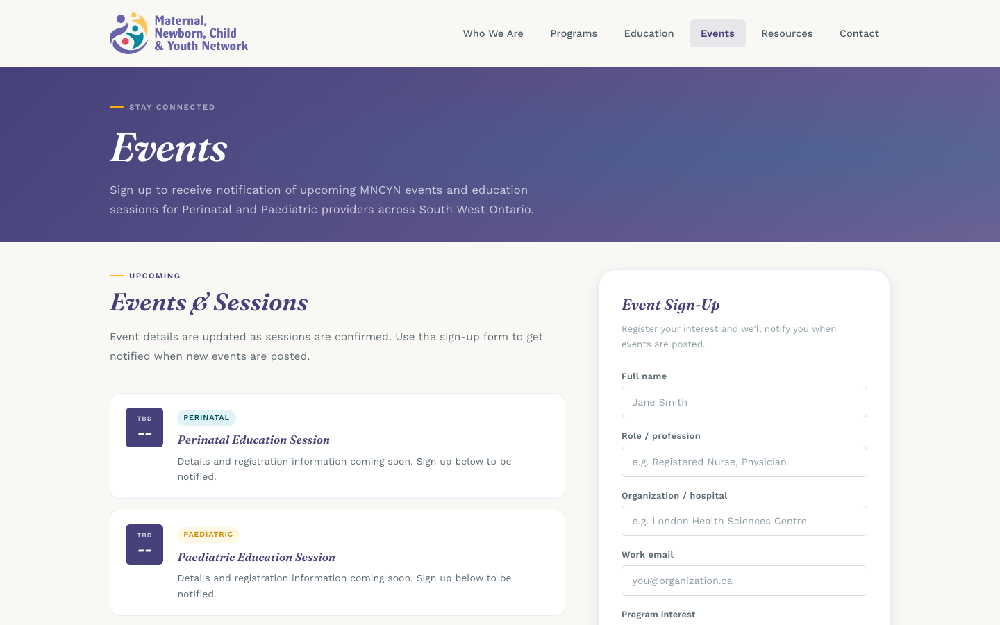
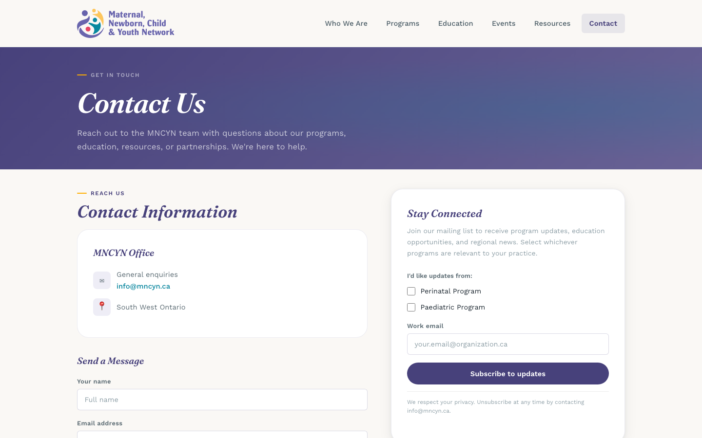
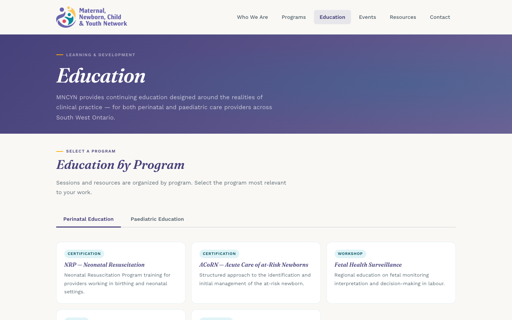
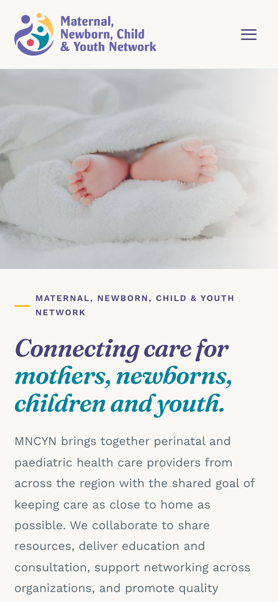

<a id="readme-top"></a>

<!-- PROJECT SHIELDS -->
[![CI][ci-shield]][ci-url]
[![Demo][demo-shield]][demo-url]
[![Status][status-shield]](#status)
[![Stack][stack-shield]](#built-with)

<!-- PROJECT LOGO -->
<br />
<div align="center">
  <a href="https://github.com/alekseiTikhonovWeb/mcnynWebsite">
    
  </a>

  <h3 align="center">MNCYN Website Redesign</h3>

  <p align="center">
    A ground-up redesign of the Maternal, Newborn, Child &amp; Youth Network website,
    built as a Fanshawe College client project by a team of three students.
    <br />
    Static React front end, no backend, all content driven by plain data files.
    <br />
    <br />
    <a href="https://mncyn.tikhonovfca.workers.dev/"><strong>Open the live demo »</strong></a>
    <br />
    <br />
    <a href="#screenshots">Screenshots</a>
    &middot;
    <a href="#project-story">Project story</a>
    &middot;
    <a href="#getting-started">Run it locally</a>
    &middot;
    <a href="#retrospective">Retrospective</a>
  </p>
</div>

<!-- TABLE OF CONTENTS -->
<details>
  <summary>Table of Contents</summary>
  <ol>
    <li>
      <a href="#about-the-project">About The Project</a>
      <ul>
        <li><a href="#screenshots">Screenshots</a></li>
        <li><a href="#pages">Pages</a></li>
        <li><a href="#how-it-is-built">How It Is Built</a></li>
        <li><a href="#repository-layout">Repository Layout</a></li>
        <li><a href="#built-with">Built With</a></li>
      </ul>
    </li>
    <li><a href="#getting-started">Getting Started</a></li>
    <li><a href="#project-story">Project Story</a></li>
    <li><a href="#status">Status</a></li>
    <li><a href="#retrospective">Retrospective</a></li>
    <li><a href="#team">Team</a></li>
    <li><a href="#content-and-license">Content and License</a></li>
    <li><a href="#contact">Contact</a></li>
    <li><a href="#acknowledgments">Acknowledgments</a></li>
  </ol>
</details>

<!-- ABOUT THE PROJECT -->
## About The Project

The [Maternal, Newborn, Child & Youth Network](https://mncyn.ca) (MNCYN) is a regional network of perinatal
and paediatric health care providers in Southwestern Ontario, based at London Health Sciences Centre. Its
audience is nurses, physicians and midwives at partner hospitals who come to the site for clinical forms,
guidelines and education. The existing site is a dated WordPress install that does not serve that audience well.

Through a collaboration between MNCYN and Fanshawe College, our team took on the redesign end to end:

* **Discovery.** Intake questionnaire with the client, review of the old site and of comparable networks,
  and a written brief on what the new site had to do.
* **Design.** A new visual identity for the web built on the MNCYN brand colours, editorial typography and a
  content structure the client described as a pyramid: who we are, the team, the programs, what we deliver,
  then education, events, resources and contact.
* **Build.** Seven pages as a React single-page app, with every piece of copy, every team bio and every
  resource link living in data files rather than in markup.
* **Feedback.** Two review rounds with the client. Their notes (rename the header, drop the stats banner,
  separate perinatal and paediatric education, replace the unused calendar with a simple sign-up) are all
  reflected in the current build.

The client signed off on the design. The site was never launched on the client's domain, for reasons that
had nothing to do with the code; see [Project Story](#project-story). This repository preserves the finished
front end, and a static build of it runs at
[mncyn.tikhonovfca.workers.dev](https://mncyn.tikhonovfca.workers.dev/).

<p align="right">(<a href="#readme-top">back to top</a>)</p>

### Screenshots

Captured from the local build at 1440 px wide, plus one phone view.

| Home | Who We Are |
|---|---|
|  |  |

| Programs | Resources |
|---|---|
|  |  |

| Events | Contact |
|---|---|
|  |  |

<details>
  <summary>Education page and phone view</summary>
  <br />

  | Education | Home, 390 px |
  |---|---|
  |  |  |
</details>

<p align="right">(<a href="#readme-top">back to top</a>)</p>

### Pages

| Route | What is on it |
|---|---|
| `/` | Hero with the client's approved tagline, short "who we are" band, overview of the two programs, quick access to the resource library, newsletter card |
| `/about` | Mission, four strategic pillars, core and medical team with bios in a modal, history timeline from 1979 to today |
| `/programs` | The Perinatal and Paediatric programs side by side, plus the six MNCYN deliverables (the client's word; "services" was vetoed) |
| `/education` | Perinatal and Paediatric tabs, each with its own course list, and a call-to-action into the resource library |
| `/events` | Upcoming sessions and a simple sign-up form (the client asked for this instead of the old calendar) |
| `/resources` | Searchable clinical library: 30 PDFs and external links in collapsible categories, with partner-only items shown but locked |
| `/contact` | Contact details, inquiry form, newsletter subscription, partner portal card |

The header collapses into a drawer on narrow screens, and every route scrolls to the top on navigation.

<p align="right">(<a href="#readme-top">back to top</a>)</p>

### How It Is Built

```
 browser
    │
 index.html ─► src/index.jsx ─► <BrowserRouter> ─► App.jsx
                                                  ├─ Header (NavLink, mobile drawer)
                                                  ├─ <Routes>  one folder per page
                                                  │     pages/<Page>/index.jsx      composes the page
                                                  │     pages/<Page>/components/    sections of that page only
                                                  │     pages/<Page>/<page>Data.js  every string, link and bio
                                                  └─ Footer
 src/index.css   one stylesheet: design tokens in :root, then a section per page
 public/         logo, photos, 30 client PDFs, _redirects for SPA hosting
```

* **Content is data.** Team bios, resource links, programs, events and education courses are plain
  JavaScript objects. Adding a PDF to the library is one line in `resourcesData.js`; the search, grouping and
  locked-item rendering pick it up automatically. Markup never had to change when the client sent new text.
* **Pages own their components.** A section used by only one page lives inside that page's folder. Shared
  pieces are deliberately few: `Header`, `Footer`, `ScrollToTop`, the inner-page `PageHero` and a handful of
  SVG icons. There is no component library, no CSS-in-JS and no inline styles.
* **One set of design tokens.** Colours (teal, purple, gold, ink, paper), type (Fraunces for headings, Work
  Sans for body), radii, shadows and the content width are CSS custom properties on `:root`; everything else
  references them.
* **Static by design.** No server, no database, no build-time data fetching. The output of `vite build` is a
  folder that any static host can serve; `public/_redirects` maps every path to `index.html` so deep links
  into the SPA work on Cloudflare Pages and Netlify.
* **Forms are front-end only.** The inquiry, newsletter and event sign-up forms validate and show a success
  state but do not send anywhere. A backend was out of scope for the prototype; see [Status](#status).

<p align="right">(<a href="#readme-top">back to top</a>)</p>

### Repository Layout

```
mcnynWebsite/
├─ index.html                  entry, loads Google Fonts and src/index.jsx
├─ vite.config.js              React plugin, base "/"
├─ src/
│  ├─ index.jsx                React root + BrowserRouter
│  ├─ App.jsx                  routes, header, footer
│  ├─ index.css                design tokens and all styles, one section per page
│  ├─ components/              Header (with mobile drawer), Footer, ScrollToTop, PageHero, icons
│  └─ pages/
│     ├─ Home/                 HomeHero, AboutBand, ProgramsOverview, ResourcesQuickAccess, HomeNewsletter
│     ├─ About/                aboutData.js: team, pillars, history; TeamSection, TeamMemberModal, HistoryTimeline
│     ├─ Programs/             programsData.js: the two programs and the deliverables; ProgramDetailCards, DeliverablesGrid
│     ├─ Education/            educationData.js: courses per program; EducationTabs, CoursePanel
│     ├─ Events/               eventsData.js; EventList, EventSignUpForm
│     ├─ Resources/            resourcesData.js: the library; ResourceSearchCard, ResourceCategoryAccordion, ResourceResultsView
│     └─ Contact/              ContactInfo, InquiryForm, NewsletterCard, PartnerPortalCard
├─ public/
│  ├─ images/                  logo, hero photo, team portraits, history photos
│  ├─ content/resources/       clinical PDFs served by the resource library
│  └─ _redirects               SPA fallback for static hosts
├─ docs/screenshots/           the images in this README
└─ .github/workflows/ci.yml    npm ci + vite build on every push
```

<p align="right">(<a href="#readme-top">back to top</a>)</p>

### Built With

* [![React][React-badge]][React-url]
* [![Vite][Vite-badge]][Vite-url]
* [![React Router][ReactRouter-badge]][ReactRouter-url]
* [![GitHub Actions][Actions-badge]][Actions-url]

Typography is [Fraunces](https://fonts.google.com/specimen/Fraunces) and
[Work Sans](https://fonts.google.com/specimen/Work+Sans), loaded from Google Fonts.

<p align="right">(<a href="#readme-top">back to top</a>)</p>

<!-- GETTING STARTED -->
## Getting Started

Requires Node.js 20.19+ (or 22.12+) and npm.

```sh
git clone https://github.com/alekseiTikhonovWeb/mcnynWebsite.git
cd mcnynWebsite
npm ci
npm run dev        # http://localhost:5173
```

```sh
npm run build      # production bundle in dist/
npm run preview    # serve dist/ locally
```

To host it, point any static host at `dist/`. The demo at
[mncyn.tikhonovfca.workers.dev](https://mncyn.tikhonovfca.workers.dev/) is exactly that: the production
build served as static assets from Cloudflare Workers. Cloudflare and Netlify pick up `_redirects` and serve
the SPA correctly on deep links. GitHub Pages would additionally need `base` in `vite.config.js` set to the
repository path, because the site references assets from the root.

<p align="right">(<a href="#readme-top">back to top</a>)</p>

<!-- PROJECT STORY -->
## Project Story

| When | What happened |
|---|---|
| Dec 2025 | A Fanshawe evaluation of the existing MNCYN site sets the goal: a site that works for the clinicians who actually use it |
| Feb 2026 | Intake questionnaire answered by the client; first static HTML prototype of the home page |
| Mar 2026 | Resources page rebuilt around the client's real document library; client supplies the "About Us" content and team photos; first feedback round |
| Early Apr 2026 | Migration to React + Vite, one folder per page, content moved into data files; hero, header and team section reworked from the second feedback round |
| Apr 8, 2026 | Last feature commit: new header. Client approves the design |
| After | The project stalls |
| Sep 2026 | Repository tidied for the portfolio: duplicated components and dead CSS removed, static demo deployed, this README written |

Why it stalled, honestly: the term ended and the team went to work; the client's web agency, which would host
and maintain the site, only works with WordPress, so a React build had no home on their side; and nobody was
left with the mandate to either port the design to a WordPress theme or set up separate hosting. The old site
is still live. None of that changes what was built, which is why the code is here.

<p align="right">(<a href="#readme-top">back to top</a>)</p>

<!-- STATUS -->
## Status

Design and front end are complete and approved. What is not done, and would be the next steps if the project
were revived:

- [ ] **Form backend.** The three forms need an endpoint (a Cloudflare Worker, Formspree or the client's
      newsletter provider). Everything on the client side is in place.
- [ ] **Remaining content from the client.** Four team members still have a placeholder portrait and a
      one-line bio; the events list and the education session dates are marked "coming soon" pending the
      client's schedule.
- [ ] **Hosting on the client's side.** Their agency maintains WordPress only, so shipping means either
      hosting this build for them or porting the design into a WordPress theme.
- [x] Seven pages, responsive layout, mobile navigation
- [x] Searchable resource library with the client's 30 documents
- [x] Client feedback rounds applied
- [x] Production build verified in CI
- [x] Static demo on Cloudflare Workers

<p align="right">(<a href="#readme-top">back to top</a>)</p>

<!-- RETROSPECTIVE -->
## Retrospective

The visual result is the client's taste, and the client is the one who has to like it. The engineering is
what I would do differently today:

* **Split the stylesheet.** `index.css` grew out of the static-HTML phase and at one point was two
  stylesheets pasted together. It is now one consolidated file of about 2,700 lines, but it should be one
  file per page next to the page's components, with only the tokens and the reset shared.
* **Give the client a content editor.** Data files were a good first step (the client never had to open JSX),
  but the right end state is a headless CMS or Markdown so they can update a bio without a developer.
* **Keep client documents out of the repository.** The 20 MB of clinical PDFs in `public/content/` belong on
  the client's own storage, referenced by URL.
* **TypeScript and a test or two.** The data files have an implicit schema (`locked`, `type`, `link`,
  `subcategories`) that a type would document and a test would guard.
* **Decide hosting on day one.** The single biggest reason the site did not ship was a hosting constraint we
  learned about at the end. It should have been the first question in the intake.

<p align="right">(<a href="#readme-top">back to top</a>)</p>

<!-- TEAM -->
## Team

Three Fanshawe College students, working with the MNCYN team as the client.

| | Focus |
|---|---|
| [@alekseiTikhonovWeb](https://github.com/alekseiTikhonovWeb) | Design system and tokens, home page and hero, header, React + Vite migration and project setup |
| [@penguinfc](https://github.com/penguinfc) | Resource library (search, categories, locked items), page restructuring, styling passes |
| [@abouhalarayan-coder](https://github.com/abouhalarayan-coder) | "About Us" content, team bios and photos, client liaison for content |

<p align="right">(<a href="#readme-top">back to top</a>)</p>

<!-- CONTENT AND LICENSE -->
## Content and License

All text, the logo, the photographs and the PDF documents in `public/` belong to the Maternal, Newborn, Child
& Youth Network and appear here only so that the site can be seen as it was delivered. They are not licensed
for reuse.

The code has no license. This is a portfolio project: it is shared to be read and discussed, not to be
reused. If you want to use any part of it, ask.

<p align="right">(<a href="#readme-top">back to top</a>)</p>

<!-- CONTACT -->
## Contact

Aleksei Tikhonov · [@alekseiTikhonovWeb](https://github.com/alekseiTikhonovWeb) · support@wasd.digital

Project: [https://github.com/alekseiTikhonovWeb/mcnynWebsite](https://github.com/alekseiTikhonovWeb/mcnynWebsite)

<p align="right">(<a href="#readme-top">back to top</a>)</p>

<!-- ACKNOWLEDGMENTS -->
## Acknowledgments

* The MNCYN team, for the brief, the content and two rounds of precise feedback
* Fanshawe College, for setting up the collaboration
* [Best-README-Template](https://github.com/othneildrew/Best-README-Template)

<p align="right">(<a href="#readme-top">back to top</a>)</p>

<!-- MARKDOWN LINKS & IMAGES -->
[ci-shield]: https://github.com/alekseiTikhonovWeb/mcnynWebsite/actions/workflows/ci.yml/badge.svg
[ci-url]: https://github.com/alekseiTikhonovWeb/mcnynWebsite/actions/workflows/ci.yml
[demo-shield]: https://img.shields.io/badge/demo-mncyn.tikhonovfca.workers.dev-00829B?style=flat-square
[demo-url]: https://mncyn.tikhonovfca.workers.dev/
[status-shield]: https://img.shields.io/badge/status-design%20approved%2C%20not%20launched-6d4aff?style=flat-square
[stack-shield]: https://img.shields.io/badge/stack-React%2019%20%C2%B7%20Vite%208-00829B?style=flat-square
[React-badge]: https://img.shields.io/badge/React-20232A?style=for-the-badge&logo=react&logoColor=61DAFB
[React-url]: https://react.dev/
[Vite-badge]: https://img.shields.io/badge/Vite-646CFF?style=for-the-badge&logo=vite&logoColor=white
[Vite-url]: https://vite.dev/
[ReactRouter-badge]: https://img.shields.io/badge/React_Router-CA4245?style=for-the-badge&logo=reactrouter&logoColor=white
[ReactRouter-url]: https://reactrouter.com/
[Actions-badge]: https://img.shields.io/badge/GitHub_Actions-2088FF?style=for-the-badge&logo=githubactions&logoColor=white
[Actions-url]: https://github.com/features/actions
